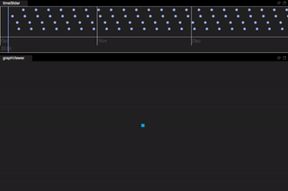

# Many World graph: samples
This project contains minimalist but easy to hack mwg samples.
These samples highlights features implemented in Core, Core JS and the various plugins.
This small project gices hints about temporal graphs illustrated as follow:

## 0: pom.xml
This project define the classic way to import mwg in your code using maven.
Have a look to the pom.xml definition that give you an illustration of the various dependencies that you can use.

## 1: Minimal.java
The MWG hello world, cover node creation, attributes and relationships manipulation.

## 2: Temporal
Before everything, MWG is design to handle temporal data.
This sample shows the various usage of jump and lookup over timed variation of data.

## 3: Index
Indexes are entry-points of MWG declare by developer to enable fast access to specific node.
This sample highlight the various usage of index method to lookup a node based on its attributes values.

## 4: Server
Graph can be remotely accessed to design a client/server architecture.
This sample shows how to expose your graph as a WebSocket serer.

## 5: Client
Graph can remotely pull data from a remote server.
Following this sample you will be able to connect a graph to its peer server.

## 6: Task

Avoiding the callback hell !
The Task API provide nice API to chain action and pipe operation on top of MWG data.

## 7: Browser

TODO
